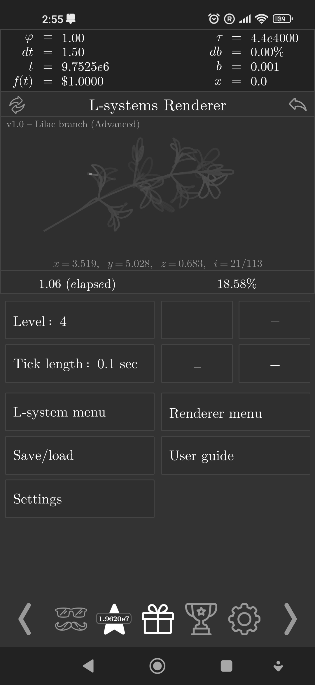
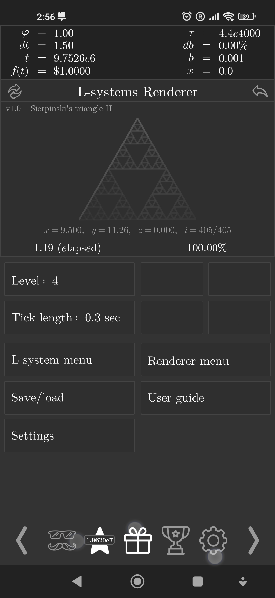
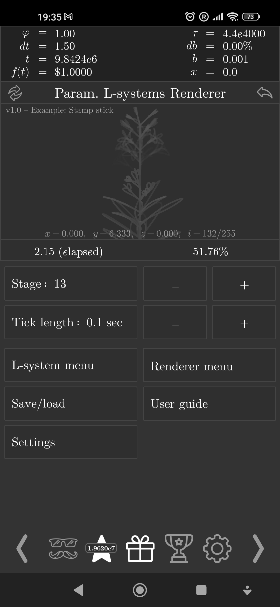
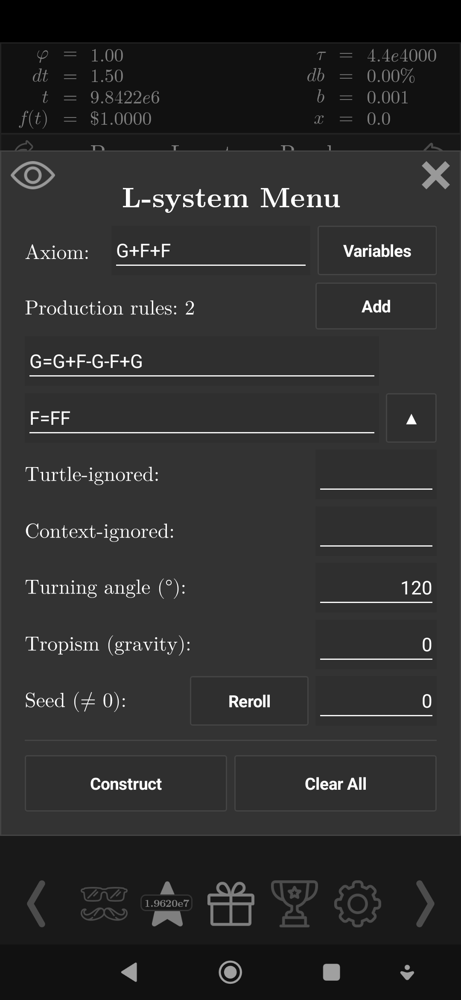
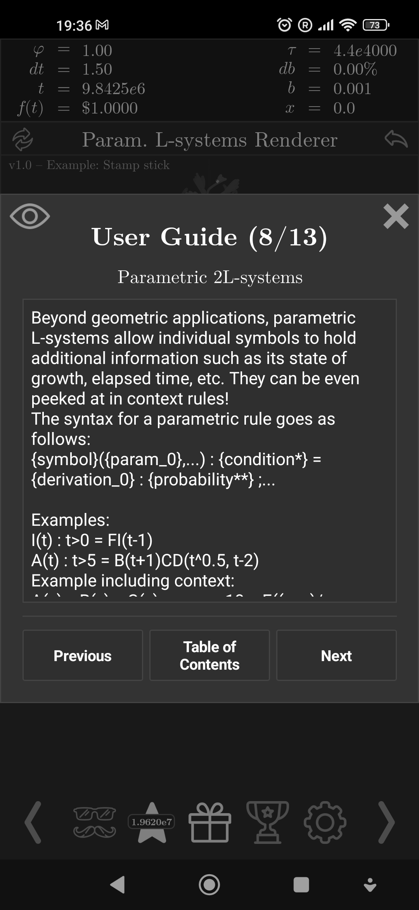

# L-systems Renderer

An implementation of L-systems in Exponential Idle.

## Installation

Two editions of the LSR are available. The Classic edition is lighter in terms
of processing, but does not support parametric or context-sensitive syntax.

- [Classic](./classic.js)
- [Parametric](./parametric.js)

Navigate to the edition you want to download, click on the link, then click on
`Raw`. You will be delivered to the theory's raw code. Copy the page's URL.

Then, access the custom theory panel within the game (unlocked after finishing
T9, the last theory) then enter the picking menu. Press the `+` symbol and
paste the URL in.

## Features

- Parametric, context-sensitive (2L) systems
- Stochastic (randomised) rules
- 3D turtle controls
- Polygon modelling

Other features:
- Can save a whole army of systems!
- Camera modes: static and turtle-following
- Drawing speed and advanced stroke options!

In 0.20, more care has been taken with regards to the internal state, as it's
been converted to JSON instead of pure text. However, it still might break.
Be sure to back it up to another save before updating, and in case it's
corrupted, please contact me. From now on, there's also an option to export the
internal state in the theory menu, so please back it up.

## Screenshots

