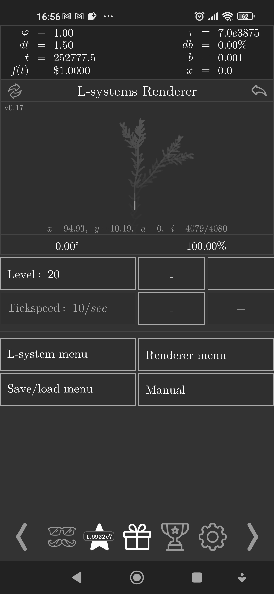
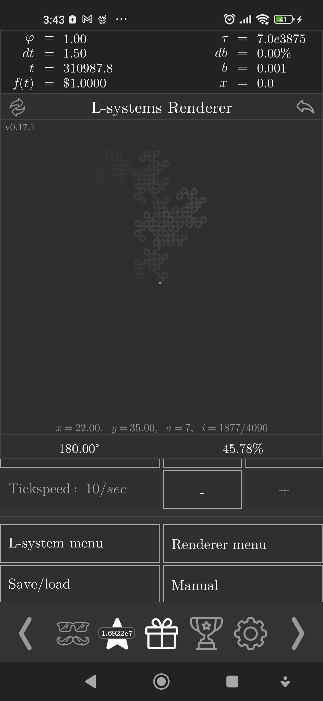
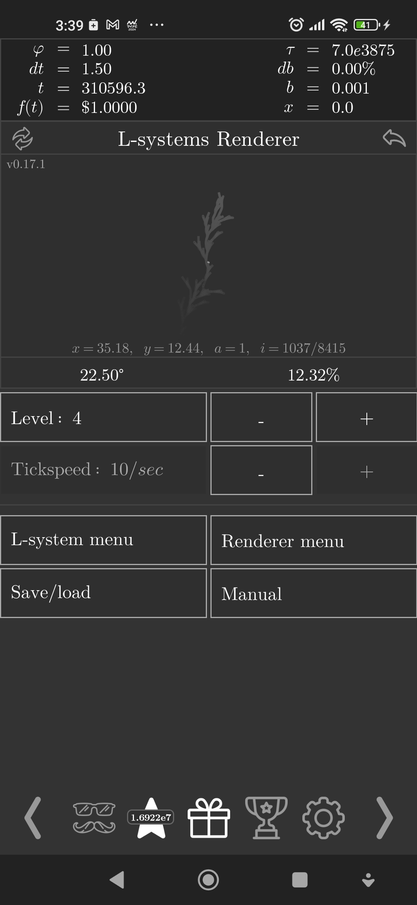

# L-systems-renderer

L-systems renderer in Exponential Idle.

## Features

- Supports 3D drawing
- Can store a whole army of systems!
- Two camera mode: fixed (scaled) and cursor-focused
- Stroke options

## Installation

Current version: 0.18

Navigate to [`renderer.js`](./renderer.js) and click on `Raw`. You will be
delivered to this theory's raw code. Copy the page's URL.

Then, access the custom theory panel within the game (unlocked after finishing
the Convergence Test) then enter the picking menu. Press the plus symbol and
paste the URL in.

## Screenshots

