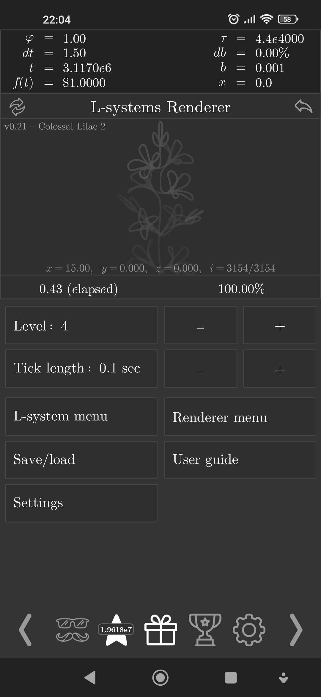
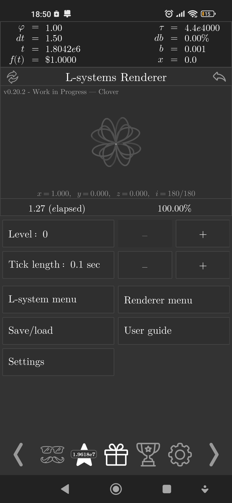
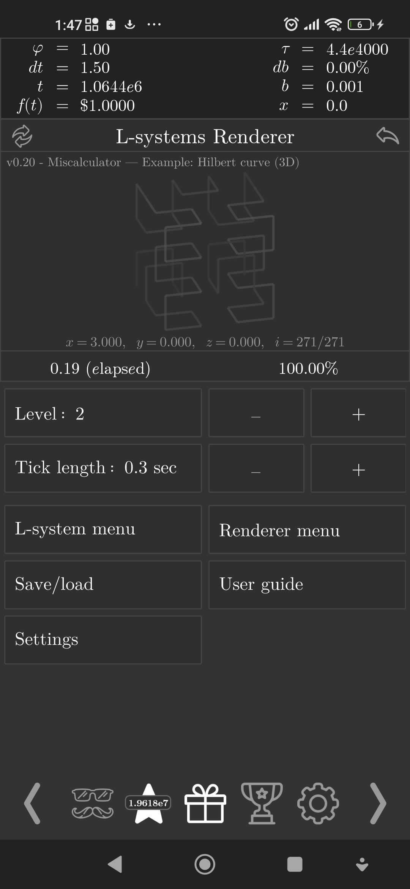
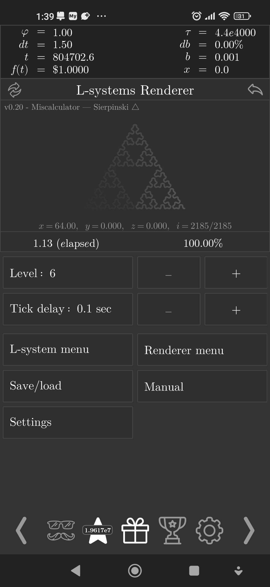

# L-systems-renderer

L-systems renderer in Exponential Idle.

## Features

Supported L-system features:
- Stochastic (randomised) rules
- 3D turtle controls
- Polygon modelling

Other features:
- Can save a whole army of systems!
- Camera modes: static and turtle-following
- Drawing speed and advanced stroke options!

In 0.20, more care has been taken with regards to the internal state, as it's
been converted to JSON instead of pure text. However, it still might break.
Be sure to back it up to another save before updating, and in case it's
corrupted, please contact me. From now on, there's also an option to export the
internal state in the theory menu, so please back it up.

## Installation

Current version: 0.21.1

Navigate to [`renderer.js`](./renderer.js) and click on `Raw`. You will be
delivered to this theory's raw code. Copy the page's URL.

Then, access the custom theory panel within the game (unlocked after finishing
T9, the last theory) then enter the picking menu. Press the `+` symbol and
paste the URL in.

## Screenshots

